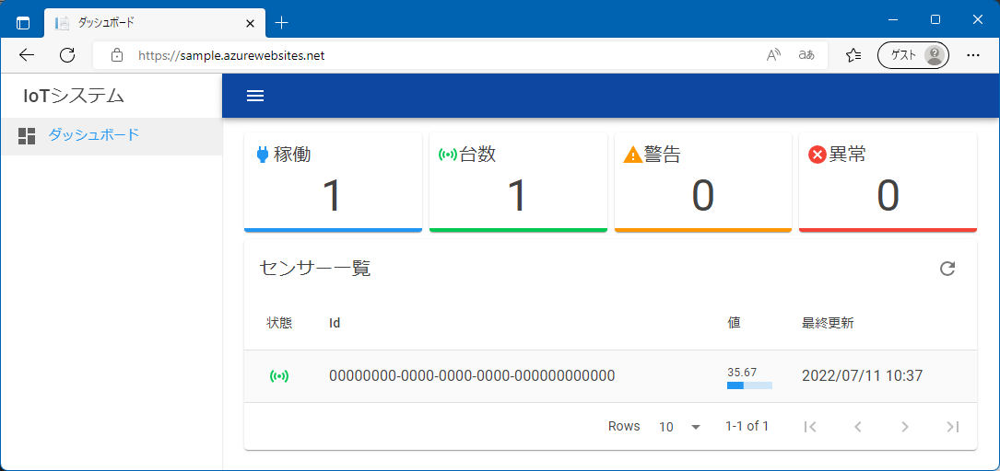

# Template project for Azure

## 🍀 基本

* Azure IoT Hub、Functions、App Serviceを使用したIoTプロジェクト構成の雛形を提供する

## ✨ 実装機能

* IoT HubからのイベントによるIoTHubTriggerでのデータベースアクセス
* App Serviceによるデータベースの内容の表示




## 🔨 設定

サンプルの動作確認に必要な設定項目について。

### データベース

* 以下のテーブルを作成し、センサーデータのエントリを用意しておく

```sql
CREATE TABLE Sensor (
    Id uniqueidentifier NOT NULL,
    Value real NOT NULL,
    Timestamp datetimeoffset(3) NOT NULL,
    CONSTRAINT PK_Sensor PRIMARY KEY CLUSTERED (Id)
)
```

### Functions

* 関数アプリの構成で以下の値を設定しておく

| 名前 | 値
|:-|:-|
|HubConnectionString|Endpoint=...(IoT Hubの組み込みのエンドポイントの値)|
|SQLConnectionString|Server=...(SQL Databaseの接続文字列の値)|

### App Service

* 関数アプリの構成で以下の値を設定しておく

| 名前 | 値
|:-|:-|
|ConnectionStrings__SQL|Server=...(SQL Databaseの接続文字列の値))|

### Deviceクライアント

* Microsoft.Azure.Devices.Clientを使用したクライアントサンプルを動作させる場合、ソースの以下の部分を変更する

```csharp
public static class Program
{
    // IoT Hubのデバイスの接続文字列
    private const string ConnectionString =
        "HostName={hub}.azure-devices.net;DeviceId={deviceId};SharedAccessKey={ssa}";

    // データベースに登録したデバイスのID
    private static readonly Guid Id = Guid.Parse("00000000-0000-0000-0000-000000000000");
```

### MQTTクライアント

* MQTTを直接使用するクライアントサンプルを動作させる場合、ソースの以下の部分を変更する

```csharp
public static class Program
{
    // IoT Hubのホスト名
    private const string Server = "{name}.azure-devices.net";
    // IoT Hubに登録したデバイスID
    private const string ClientId = "{deviceId}";
    private const string Username = $"{Server}/{ClientId}/api-version=2021-04-12";
    // az iot hub generate-sas-token 等で作成したSASトークン
    private const string Password = "{SharedAccessSignature ...}";
    private const string TopicD2C = $"devices/{ClientId}/messages/events/";

    // データベースに登録したデバイスのID
    private static readonly Guid Id = Guid.Parse("00000000-0000-0000-0000-000000000000");
```
